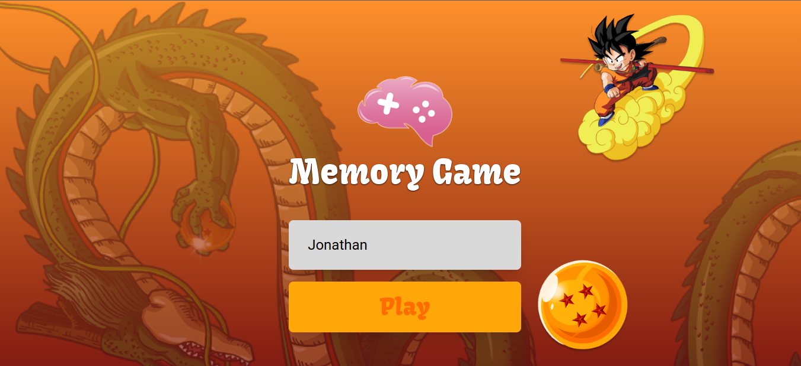
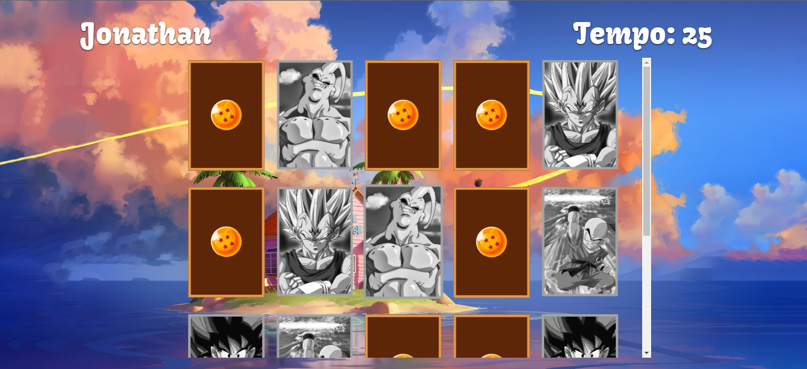
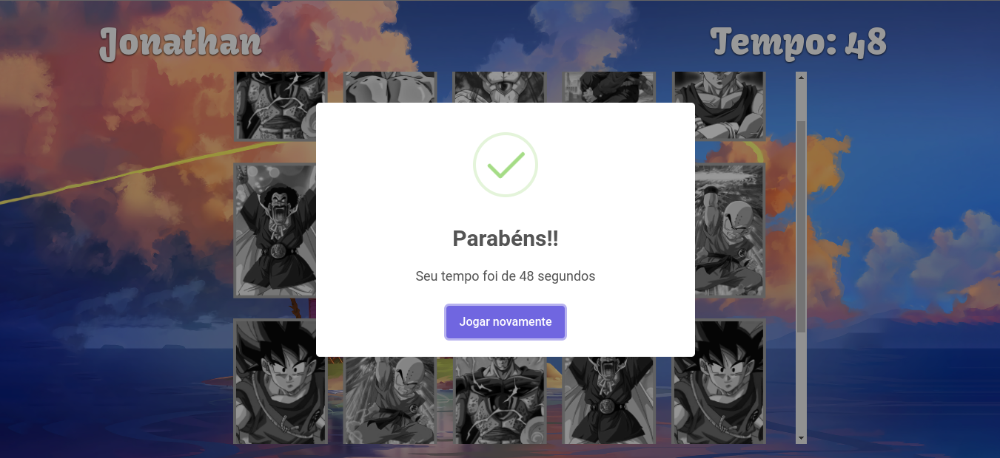

<h1 align="center">Jogo da Memória</h1>

<h2 align="center">
Explore o mundo de Dragon Ball Z com nosso jogo da memória! Encontre os pares de cartas dos personagens favoritos enquanto o tempo corre contra você. Vença o desafio e se divirta com uma página de erro 404 única. Está pronto para o desafio?
</h2>

<h3 align="center"> Este projeto foi desenvolvido com base em uma ideia encontrada em 
     <a target="_blank" href="https://codante.io/mini-projetos/jogo-da-memoria-com-react">codante</a>. 
</h3>

<h3 align="center">
     <a target="_blank" href="https://jogo-da-memoria-phi-seven.vercel.app/">Testar Projeto</a>
</h3>

<h2>🎨 Demonstração</h2>

    
    
     

<h2>🛠 Conhecimentos Utilizados</h2>

- React JS
- React Router Dom
- TypeScript
- Tailwind CSS
- React Card Flip

<h2>📫 Feedback</h2>

<h3 align="center">
     Se você tiver algum feedback, posso ser encontrado em:
</h3>

   
    

